# Граф вызовов методов класса ThisAddIn

Этот документ содержит полный граф вызовов методов внутри класса `ThisAddIn` из файла `ThisAddIn.cs`.

## Визуализация графа вызовов (Mermaid)

```mermaid
graph TD
    %% Точки входа (события)
    InternalStartup[InternalStartup] --> ThisAddIn_Startup[ThisAddIn_Startup]
    InternalStartup --> ThisAddIn_Shutdown[ThisAddIn_Shutdown]
    
    %% Цепочка вызовов из ThisAddIn_Startup
    ThisAddIn_Startup --> EnsurePaneForWindow[EnsurePaneForWindow]
    ThisAddIn_Startup --> ApplySavedPaneSettings[ApplySavedPaneSettings]
    ThisAddIn_Startup --> MarkdownRibbon_new["new MarkdownRibbon()"]
    
    %% Цепочка вызовов из ThisAddIn_Shutdown
    ThisAddIn_Shutdown --> SaveMarkdownToDocument[SaveMarkdownToDocument]
    
    %% Цепочка вызовов из EnsurePaneForWindow
    EnsurePaneForWindow --> LoadMarkdownFromDocument[LoadMarkdownFromDocument]
    EnsurePaneForWindow --> SetMarkdown["paneControl.SetMarkdown()"]
    EnsurePaneForWindow --> SetViewMode["paneControl.SetViewMode()"]
    
    %% Цепочка вызовов из Application_DocumentOpen
    Application_DocumentOpen[Application_DocumentOpen] --> EnsurePaneForWindow
    
    %% Цепочка вызовов из Application_WindowActivate
    Application_WindowActivate[Application_WindowActivate] --> EnsurePaneForWindow
    
    %% Цепочка вызовов из Application_DocumentBeforeClose
    Application_DocumentBeforeClose[Application_DocumentBeforeClose] --> GetCachedMarkdown["paneControl.GetCachedMarkdown()"]
    Application_DocumentBeforeClose --> SaveMarkdownToDocument
    
    %% Цепочка вызовов из Application_DocumentBeforeSave
    Application_DocumentBeforeSave[Application_DocumentBeforeSave] --> GetCachedMarkdown2["paneControl.GetCachedMarkdown()"]
    Application_DocumentBeforeSave --> SaveMarkdownToDocument
    
    %% Цепочка вызовов из TogglePane
    TogglePane[TogglePane] --> MarkdownPane_getter[MarkdownPane getter]
    
    %% Цепочка вызовов из LoadMarkdownFromDocument
    LoadMarkdownFromDocument --> FindExistingPart[FindExistingPart]
    
    %% Цепочка вызовов из SaveMarkdownToDocument
    SaveMarkdownToDocument --> FindExistingPart2[FindExistingPart]
    SaveMarkdownToDocument --> BuildMarkdownXml[BuildMarkdownXml]
    
    %% Стили для разных типов методов
    classDef eventHandler fill:#e1f5ff,stroke:#01579b,stroke-width:2px
    classDef internalMethod fill:#f3e5f5,stroke:#4a148c,stroke-width:2px
    classDef externalCall fill:#fff3e0,stroke:#e65100,stroke-width:2px
    classDef property fill:#e8f5e9,stroke:#1b5e20,stroke-width:2px
    
    class InternalStartup,ThisAddIn_Startup,ThisAddIn_Shutdown,Application_DocumentOpen,Application_WindowActivate,Application_DocumentBeforeClose,Application_DocumentBeforeSave eventHandler
    class EnsurePaneForWindow,LoadMarkdownFromDocument,SaveMarkdownToDocument,FindExistingPart,BuildMarkdownXml,ApplySavedPaneSettings internalMethod
    class MarkdownRibbon_new,SetMarkdown,SetViewMode,GetCachedMarkdown,GetCachedMarkdown2 externalCall
    class MarkdownPane_getter property
```



## Детальный список всех методов и их вызовов

### 1. InternalStartup (строка 725)
**Тип:** Приватный метод (автоматически создан VSTO)  
**Вызывает:**
- `ThisAddIn_Startup` (подписка на событие Startup)
- `ThisAddIn_Shutdown` (подписка на событие Shutdown)

---

### 2. ThisAddIn_Startup (строка 152)
**Тип:** Обработчик события Startup  
**Вызывает методы класса ThisAddIn:**
- `EnsurePaneForWindow(this.Application.ActiveWindow)` (строка 175)
- `ApplySavedPaneSettings(createdPane)` (строка 185)

**Вызывает внешние методы/конструкторы:**
- `new MarkdownRibbon()` (строка 198)

**Использует свойства:**
- `this.Application` (строка 163-166, 173)
- `this.Application.ActiveWindow` (строка 173, 183)
- `_markdownPanes.TryGetValue()` (строка 183)

---

### 3. ThisAddIn_Shutdown (строка 231)
**Тип:** Обработчик события Shutdown  
**Вызывает методы класса ThisAddIn:**
- `SaveMarkdownToDocument(doc, md)` (строка 270)

**Вызывает внешние методы:**
- `paneControl.GetCachedMarkdown()` (строка 269) - метод класса `TaskPaneControl`

**Использует свойства:**
- `_paneControls` (строка 262)
- `_markdownPanes` (строка 248, 250, 281)

---

### 4. EnsurePaneForWindow (строка 337)
**Тип:** Приватный метод  
**Вызывает методы класса ThisAddIn:**
- `LoadMarkdownFromDocument(doc)` (строка 379)

**Вызывает внешние методы:**
- `paneControl.SetMarkdown(md)` (строка 382) - метод класса `TaskPaneControl`
- `paneControl.SetViewMode(savedMode)` (строка 397) - метод класса `TaskPaneControl`

**Использует свойства:**
- `this.CustomTaskPanes` (строка 349)
- `this.Properties` (строка 356, 366)
- `_markdownPanes` (строка 342, 372)
- `_paneControls` (строка 373)
- `Settings.Default.ViewMode` (строка 390)

---

### 5. Application_DocumentOpen (строка 422)
**Тип:** Обработчик события DocumentOpen  
**Вызывает методы класса ThisAddIn:**
- `EnsurePaneForWindow(window)` (строка 430)

---

### 6. Application_WindowActivate (строка 456)
**Тип:** Обработчик события WindowActivate  
**Вызывает методы класса ThisAddIn:**
- `EnsurePaneForWindow(Wn)` (строка 463)

---

### 7. Application_DocumentBeforeClose (строка 492)
**Тип:** Обработчик события DocumentBeforeClose  
**Вызывает методы класса ThisAddIn:**
- `SaveMarkdownToDocument(Doc, md)` (строка 507)

**Вызывает внешние методы:**
- `paneControl.GetCachedMarkdown()` (строка 506) - метод класса `TaskPaneControl`

**Использует свойства:**
- `_paneControls` (строка 498)
- `_markdownPanes` (строка 512, 514, 528)
- `this.CustomTaskPanes` (строка 517)

---

### 8. Application_DocumentBeforeSave (строка 549)
**Тип:** Обработчик события DocumentBeforeSave  
**Вызывает методы класса ThisAddIn:**
- `SaveMarkdownToDocument(Doc, md)` (строка 559)

**Вызывает внешние методы:**
- `paneControl.GetCachedMarkdown()` (строка 558) - метод класса `TaskPaneControl`

**Использует свойства:**
- `_paneControls` (строка 554)

---

### 9. TogglePane (строка 582)
**Тип:** Публичный метод  
**Использует свойства:**
- `MarkdownPane` (строка 584) - статическое свойство (getter)

---

### 10. LoadMarkdownFromDocument (строка 607)
**Тип:** Приватный метод  
**Вызывает методы класса ThisAddIn:**
- `FindExistingPart(doc)` (строка 612)

---

### 11. SaveMarkdownToDocument (строка 624)
**Тип:** Приватный метод  
**Вызывает методы класса ThisAddIn:**
- `FindExistingPart(doc)` (строка 629)
- `BuildMarkdownXml(markdown ?? string.Empty)` (строка 634)

**Вызывает внешние методы:**
- `doc.CustomXMLParts.Add(xml)` (строка 635) - метод объекта Word.Document

---

### 12. FindExistingPart (строка 640)
**Тип:** Приватный метод  
**Не вызывает методы класса ThisAddIn**  
**Использует внешние свойства/методы:**
- `doc.CustomXMLParts` (строка 644)
- `Services.DocumentSyncService.NamespaceUri` (строка 650)

---

### 13. BuildMarkdownXml (строка 662)
**Тип:** Приватный метод  
**Не вызывает методы класса ThisAddIn**  
**Использует внешние свойства:**
- `Services.DocumentSyncService.NamespaceUri` (строка 664)

---

### 14. ApplySavedPaneSettings (строка 669)
**Тип:** Приватный метод  
**Не вызывает методы класса ThisAddIn**  
**Использует свойства:**
- `this.Properties` (строка 672, 677, 695, 700)

---

## Свойства класса

### MarkdownPane (getter, строка 62)
**Тип:** Статическое свойство  
**Использует:**
- `Instance` (строка 67) - статическое свойство
- `Instance.Application` (строка 67)
- `Instance.Application.ActiveWindow` (строка 67, 70)
- `_markdownPanes.TryGetValue()` (строка 70)

### PaneControl (getter, строка 92)
**Тип:** Статическое свойство  
**Использует:**
- `Instance` (строка 97) - статическое свойство
- `Instance.Application` (строка 97)
- `Instance.Application.ActiveWindow` (строка 97, 100)
- `_paneControls.TryGetValue()` (строка 100)

---

## Полная матрица вызовов методов

| Вызывающий метод | Вызываемый метод | Строка | Тип вызова |
|-----------------|------------------|--------|------------|
| InternalStartup | ThisAddIn_Startup | 727 | Подписка на событие |
| InternalStartup | ThisAddIn_Shutdown | 728 | Подписка на событие |
| ThisAddIn_Startup | EnsurePaneForWindow | 175 | Прямой вызов |
| ThisAddIn_Startup | ApplySavedPaneSettings | 185 | Прямой вызов |
| EnsurePaneForWindow | LoadMarkdownFromDocument | 379 | Прямой вызов |
| Application_DocumentOpen | EnsurePaneForWindow | 430 | Прямой вызов |
| Application_WindowActivate | EnsurePaneForWindow | 463 | Прямой вызов |
| Application_DocumentBeforeClose | SaveMarkdownToDocument | 507 | Прямой вызов |
| Application_DocumentBeforeSave | SaveMarkdownToDocument | 559 | Прямой вызов |
| LoadMarkdownFromDocument | FindExistingPart | 612 | Прямой вызов |
| SaveMarkdownToDocument | FindExistingPart | 629 | Прямой вызов |
| SaveMarkdownToDocument | BuildMarkdownXml | 634 | Прямой вызов |
| TogglePane | MarkdownPane (getter) | 584 | Использование свойства |

---

## Цепочки вызовов (Call Chains)

### Цепочка 1: Инициализация при старте
```
InternalStartup 
  → ThisAddIn_Startup 
    → EnsurePaneForWindow 
      → LoadMarkdownFromDocument 
        → FindExistingPart
```

### Цепочка 2: Сохранение при закрытии
```
ThisAddIn_Shutdown 
  → SaveMarkdownToDocument 
    → FindExistingPart
    → BuildMarkdownXml
```

### Цепочка 3: Сохранение при закрытии документа
```
Application_DocumentBeforeClose 
  → SaveMarkdownToDocument 
    → FindExistingPart
    → BuildMarkdownXml
```

### Цепочка 4: Сохранение перед сохранением документа
```
Application_DocumentBeforeSave 
  → SaveMarkdownToDocument 
    → FindExistingPart
    → BuildMarkdownXml
```

### Цепочка 5: Открытие документа
```
Application_DocumentOpen 
  → EnsurePaneForWindow 
    → LoadMarkdownFromDocument 
      → FindExistingPart
```

### Цепочка 6: Активация окна
```
Application_WindowActivate 
  → EnsurePaneForWindow 
    → LoadMarkdownFromDocument 
      → FindExistingPart
```

---

## Примечания

1. **Внешние вызовы** (не из класса ThisAddIn):
   - `paneControl.GetCachedMarkdown()` - вызывается из `TaskPaneControl`
   - `paneControl.SetMarkdown()` - вызывается из `TaskPaneControl`
   - `paneControl.SetViewMode()` - вызывается из `TaskPaneControl`
   - `new MarkdownRibbon()` - конструктор внешнего класса
   - `doc.CustomXMLParts.Add()` - метод объекта Word.Document

2. **Событийные обработчики** подписываются в `InternalStartup`:
   - `Application.DocumentOpen` → `Application_DocumentOpen`
   - `Application.WindowActivate` → `Application_WindowActivate`
   - `Application.DocumentBeforeClose` → `Application_DocumentBeforeClose`
   - `Application.DocumentBeforeSave` → `Application_DocumentBeforeSave`

3. **Рекурсивных вызовов** в классе `ThisAddIn` не обнаружено.

4. **Циклических зависимостей** между методами класса не обнаружено.


