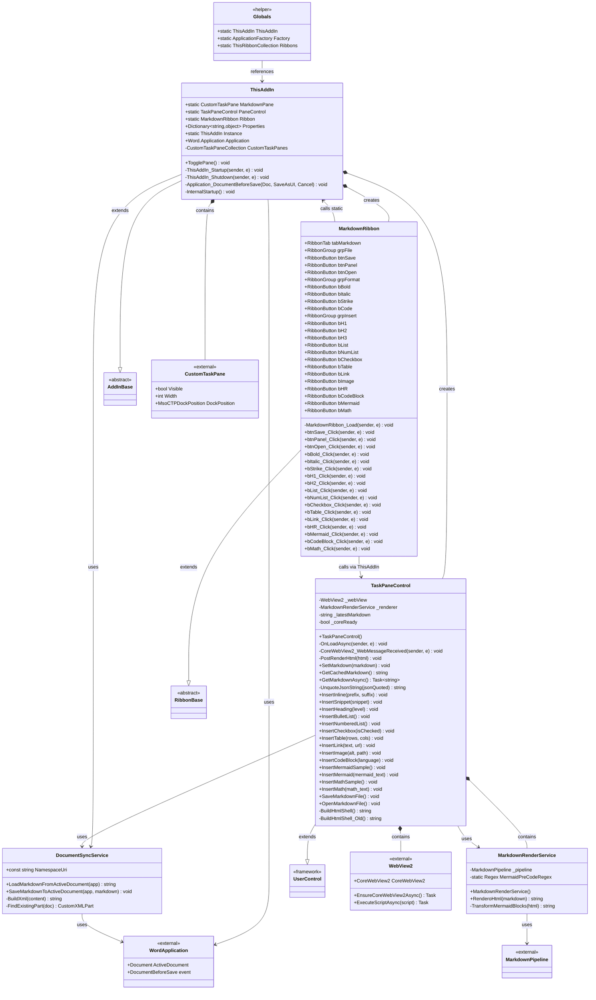
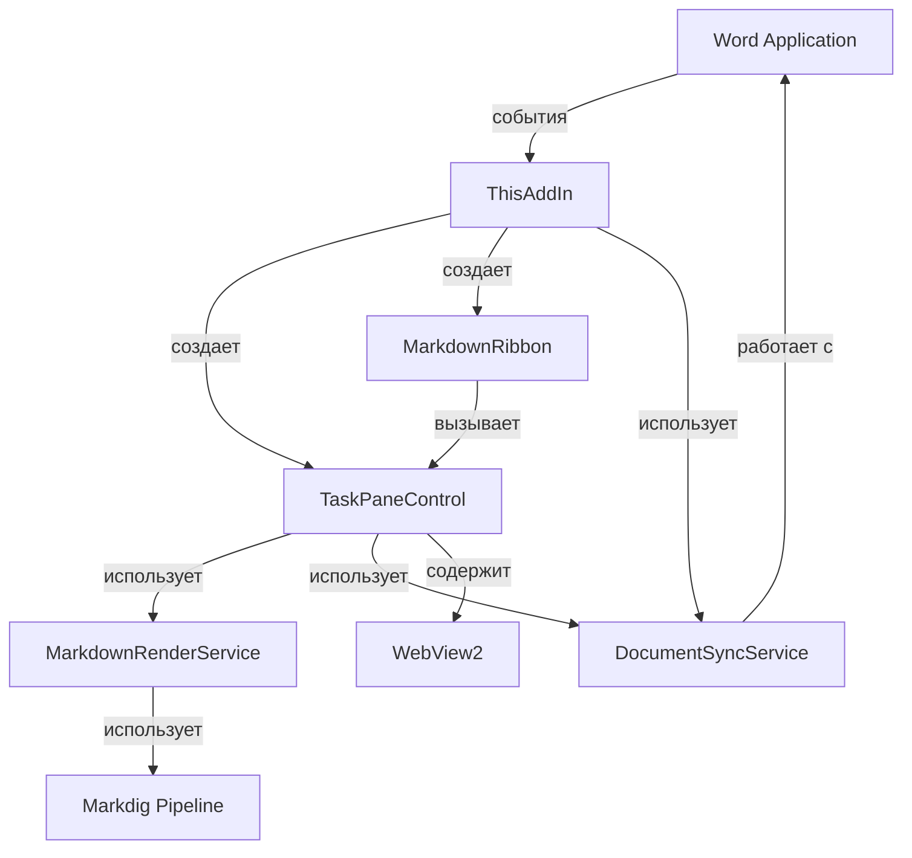

# UML Диаграмма Классов - WordMarkdownAddIn

## Описание

Этот документ содержит UML диаграмму классов проекта WordMarkdownAddIn в двух форматах:

1. **Mermaid** (в этом файле) - для отображения в GitHub, GitLab и других системах, поддерживающих Mermaid
2. **PlantUML** (файл `UML-ClassDiagram.puml`) - для использования в IDE (Visual Studio, IntelliJ IDEA) и онлайн-редакторах PlantUML

## Просмотр диаграмм

### Mermaid диаграмма
- Отображается автоматически в GitHub/GitLab
- Можно просмотреть в онлайн-редакторе: https://mermaid.live/
- Поддерживается многими Markdown просмотрщиками

### PlantUML диаграмма
- Используйте онлайн-редактор: http://www.plantuml.com/plantuml/uml/
- Или установите расширение для Visual Studio Code: "PlantUML"
- Или используйте плагин для Visual Studio

## Диаграмма классов проекта

## Описание классов

### ThisAddIn
Главный класс надстройки, наследуется от `AddInBase`. Управляет жизненным циклом приложения, создает и координирует работу всех компонентов.

**Ключевые связи:**
- Создает и управляет `CustomTaskPane` и `TaskPaneControl`
- Создает экземпляр `MarkdownRibbon`
- Использует `DocumentSyncService` для синхронизации с документами Word
- Связан с Word Application через событие `DocumentBeforeSave`

### MarkdownRibbon
Класс ленты интерфейса, наследуется от `RibbonBase`. Содержит все кнопки и обработчики событий для управления редактором Markdown.

**Ключевые связи:**
- Обращается к `TaskPaneControl` через статическое свойство `ThisAddIn.PaneControl`
- Вызывает методы `ThisAddIn.TogglePane()` для управления панелью

### TaskPaneControl
Пользовательский контрол, содержащий WebView2 редактор Markdown. Наследуется от `UserControl`. Обеспечивает все функции редактирования.

**Ключевые связи:**
- Содержит экземпляр `WebView2` для отображения HTML редактора
- Использует `MarkdownRenderService` для преобразования Markdown в HTML
- Использует `DocumentSyncService` для сохранения/загрузки Markdown

### MarkdownRenderService
Сервис для преобразования Markdown в HTML с использованием библиотеки Markdig.

**Ключевые связи:**
- Использует `MarkdownPipeline` из библиотеки Markdig
- Вызывается из `TaskPaneControl` для рендеринга предпросмотра

### DocumentSyncService
Статический сервис для синхронизации Markdown контента с Word документами через CustomXMLPart.

**Ключевые связи:**
- Использует Word Application для доступа к документам
- Работает с CustomXMLPart для хранения Markdown в документах

### Globals
Вспомогательный класс, автоматически сгенерированный VSTO. Предоставляет глобальный доступ к основным компонентам.

## Диаграмма зависимостей

## Основные паттерны

1. **Singleton**: `ThisAddIn.Instance` предоставляет единственный экземпляр надстройки
2. **Service Layer**: `DocumentSyncService` и `MarkdownRenderService` выделены в отдельные сервисы
3. **Observer**: Подписка на события Word (`DocumentBeforeSave`)
4. **Bridge**: Использование WebView2 для связи между C# и JavaScript
5. **Facade**: `ThisAddIn` предоставляет упрощенный интерфейс для доступа к компонентам

## Зависимости от внешних библиотек

- **Microsoft.Office.Tools**: Базовые классы VSTO (AddInBase, RibbonBase)
- **Microsoft.Web.WebView2**: Веб-браузер для редактора
- **Markdig**: Библиотека для преобразования Markdown в HTML
- **Microsoft.Office.Interop.Word**: COM-интерфейсы Word

