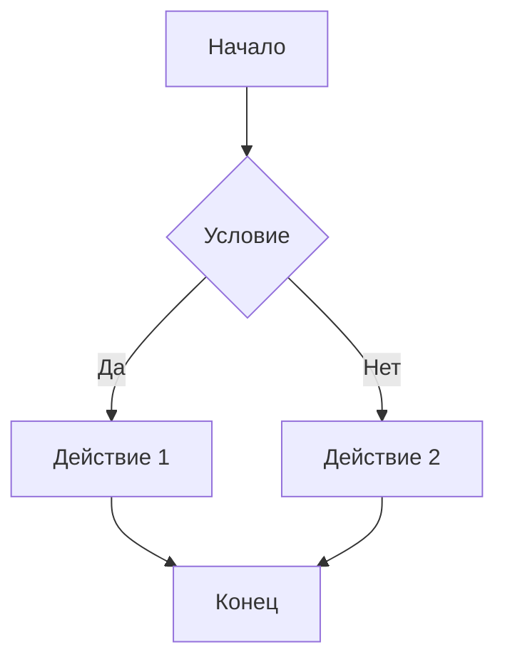
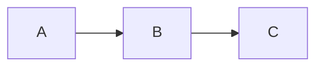
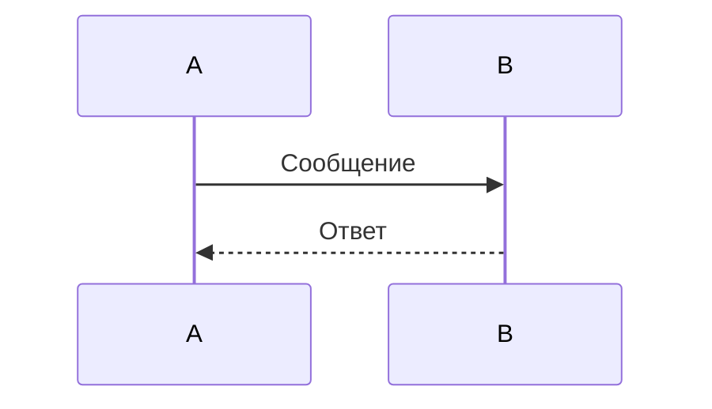

# Полная инструкция по реализации экспорта диаграмм Mermaid в PNG

## Оглавление
1. [Подготовка проекта](#этап-1-подготовка-проекта)
2. [Создание сервиса экспорта](#этап-2-создание-сервиса-экспорта-mermaid)
3. [Создание формы прогресс-бара](#этап-3-создание-формы-прогресс-бара)
4. [Добавление кнопки на ленту](#этап-4-добавление-кнопки-на-ленту)
5. [Интеграция компонентов](#этап-5-реализация-извлечения-диаграмм)
6. [Тестирование](#этап-13-тестирование)

---

## Этап 1: Подготовка проекта

### Шаг 1.1: Открытие проекта в Visual Studio 2022

1. Запустите Visual Studio 2022
2. Откройте решение: `File` → `Open` → `Project/Solution`
3. Выберите файл `WordMarkdownAddIn.sln`
4. Дождитесь полной загрузки проекта

### Шаг 1.2: Проверка зависимостей

1. Откройте файл `packages.config`
2. Убедитесь, что есть пакет `Microsoft.Web.WebView2`
3. Если нет - установите через NuGet:
   - `Tools` → `NuGet Package Manager` → `Manage NuGet Packages for Solution`
   - Найдите `Microsoft.Web.WebView2`
   - Установите версию, совместимую с вашим проектом

### Шаг 1.3: Структура папок

В `Solution Explorer` должна быть следующая структура:
```
WordMarkdownAddIn/
├── Controls/
│   └── TaskPaneControl.cs
├── Services/
│   ├── MarkdownRenderService.cs
│   └── ... (другие сервисы)
├── MarkdownRibbon.cs
└── MarkdownRibbon.Designer.cs
```

---

## Этап 2: Создание сервиса экспорта Mermaid

### Шаг 2.1: Создание файла сервиса

1. В `Solution Explorer` правой кнопкой на папку `Services`
2. Выберите `Add` → `Class...`
3. Имя класса: `MermaidExportService.cs`
4. Нажмите `Add`

### Шаг 2.2: Полный код MermaidExportService.cs

Создайте файл `Services/MermaidExportService.cs` и вставьте следующий код:

```csharp
using System;
using System.Collections.Generic;
using System.IO;
using System.Linq;
using System.Text;
using System.Text.RegularExpressions;
using System.Threading;
using System.Threading.Tasks;
using System.Windows.Forms;
using Microsoft.Web.WebView2.Core;
using Microsoft.Web.WebView2.WinForms;

namespace WordMarkdownAddIn.Services
{
    public class MermaidExportService
    {
        private static readonly Regex MermaidBlockRegex = new Regex(
            @"```mermaid\s*\n([\s\S]*?)\n```",
            RegexOptions.Compiled | RegexOptions.Multiline
        );

        public List<string> ExtractMermaidDiagrams(string markdown)
        {
            var diagrams = new List<string>();
            
            if (string.IsNullOrEmpty(markdown))
            {
                return diagrams;
            }

            var matches = MermaidBlockRegex.Matches(markdown);
            
            foreach (Match match in matches)
            {
                if (match.Groups.Count > 1)
                {
                    string diagramCode = match.Groups[1].Value.Trim();
                    if (!string.IsNullOrEmpty(diagramCode))
                    {
                        diagrams.Add(diagramCode);
                    }
                }
            }
            
            return diagrams;
        }

        private string CreateMermaidHtml(string mermaidCode)
        {
            return $@"<!DOCTYPE html>
<html>
<head>
    <meta charset=""utf-8"">
    <script src=""https://cdn.jsdelivr.net/npm/mermaid@10.9.0/dist/mermaid.min.js""></script>
    <style>
        body {{
            margin: 0;
            padding: 20px;
            background: white;
            font-family: Arial, sans-serif;
        }}
        .mermaid {{
            background: white;
        }}
    </style>
</head>
<body>
    <div class=""mermaid"">
{mermaidCode}
    </div>
    <script>
        mermaid.initialize({{ startOnLoad: true, theme: 'default' }});
        
        window.addEventListener('load', function() {{
            setTimeout(function() {{
                if (window.chrome && window.chrome.webview) {{
                    window.chrome.webview.postMessage('mermaidReady');
                }}
            }}, 1000);
        }});
    </script>
</body>
</html>";
        }

        private async Task WaitForMermaidRenderAsync(WebView2 webView)
        {
            var tcs = new TaskCompletionSource<bool>();
            bool messageReceived = false;
            
            void MessageHandler(object sender, CoreWebView2WebMessageReceivedEventArgs e)
            {
                try
                {
                    string message = e.TryGetWebMessageAsString();
                    if (message == "mermaidReady")
                    {
                        messageReceived = true;
                        webView.CoreWebView2.WebMessageReceived -= MessageHandler;
                        tcs.SetResult(true);
                    }
                }
                catch
                {
                }
            }
            
            if (webView?.CoreWebView2 != null)
            {
                webView.CoreWebView2.WebMessageReceived += MessageHandler;
            }
            
            await Task.WhenAny(
                tcs.Task,
                Task.Delay(5000)
            );
            
            if (!messageReceived && webView?.CoreWebView2 != null)
            {
                webView.CoreWebView2.WebMessageReceived -= MessageHandler;
            }
            
            await Task.Delay(500);
        }

        private async Task<byte[]> CaptureDiagramScreenshotAsync(WebView2 webView)
        {
            try
            {
                if (webView?.CoreWebView2 == null)
                {
                    throw new Exception("WebView2 не инициализирован");
                }

                using (var stream = new MemoryStream())
                {
                    await webView.CoreWebView2.CapturePreviewAsync(
                        CoreWebView2CapturePreviewImageFormat.Png,
                        stream
                    );
                    
                    return stream.ToArray();
                }
            }
            catch (Exception ex)
            {
                throw new Exception($"Ошибка при создании скриншота: {ex.Message}", ex);
            }
        }

        public async Task<bool> RenderDiagramToPngAsync(
            string mermaidCode, 
            WebView2 webView, 
            string outputPath)
        {
            try
            {
                if (webView?.CoreWebView2 == null)
                {
                    System.Diagnostics.Debug.WriteLine("WebView2 не готов для рендеринга");
                    return false;
                }

                string html = CreateMermaidHtml(mermaidCode);
                
                webView.CoreWebView2.NavigateToString(html);
                
                await Task.Delay(500);
                
                await WaitForMermaidRenderAsync(webView);
                
                byte[] imageData = await CaptureDiagramScreenshotAsync(webView);
                
                File.WriteAllBytes(outputPath, imageData);
                
                return true;
            }
            catch (Exception ex)
            {
                System.Diagnostics.Debug.WriteLine($"Ошибка рендеринга диаграммы: {ex.Message}");
                return false;
            }
        }

        public async Task<ExportResult> ExportAllDiagramsToPngAsync(
            string markdown,
            WebView2 webView,
            string outputFolder,
            IProgress<ExportProgress> progress,
            CancellationToken cancellationToken)
        {
            var result = new ExportResult
            {
                TotalDiagrams = 0,
                SuccessCount = 0,
                FailedCount = 0,
                Errors = new List<string>()
            };
            
            try
            {
                var diagrams = ExtractMermaidDiagrams(markdown);
                result.TotalDiagrams = diagrams.Count;
                
                if (diagrams.Count == 0)
                {
                    result.Errors.Add("Диаграммы Mermaid не найдены в markdown");
                    return result;
                }
                
                for (int i = 0; i < diagrams.Count; i++)
                {
                    if (cancellationToken.IsCancellationRequested)
                    {
                        result.Errors.Add("Операция отменена пользователем");
                        break;
                    }
                    
                    string fileName = $"mermaid_{i + 1}.png";
                    string outputPath = Path.Combine(outputFolder, fileName);
                    
                    progress?.Report(new ExportProgress
                    {
                        CurrentIndex = i + 1,
                        TotalCount = diagrams.Count,
                        CurrentFileName = fileName,
                        Status = "Обработка..."
                    });
                    
                    bool success = await RenderDiagramToPngAsync(
                        diagrams[i], 
                        webView, 
                        outputPath
                    );
                    
                    if (success)
                    {
                        result.SuccessCount++;
                    }
                    else
                    {
                        result.FailedCount++;
                        result.Errors.Add($"Не удалось обработать диаграмму {i + 1}: {fileName}");
                    }
                }
                
                return result;
            }
            catch (Exception ex)
            {
                result.Errors.Add($"Критическая ошибка: {ex.Message}");
                return result;
            }
        }
    }

    public class ExportResult
    {
        public int TotalDiagrams { get; set; }
        public int SuccessCount { get; set; }
        public int FailedCount { get; set; }
        public List<string> Errors { get; set; } = new List<string>();
    }

    public class ExportProgress
    {
        public int CurrentIndex { get; set; }
        public int TotalCount { get; set; }
        public string CurrentFileName { get; set; }
        public string Status { get; set; }
    }
}
```

---

## Этап 3: Создание формы прогресс-бара

### Шаг 3.1: Создание формы

1. В `Solution Explorer` правой кнопкой на проект (корневой узел)
2. Выберите `Add` → `Windows Form...`
3. Имя формы: `ProgressForm.cs`
4. Нажмите `Add`

### Шаг 3.2: Полный код ProgressForm.cs

Замените содержимое файла `ProgressForm.cs`:

```csharp
using System;
using System.Windows.Forms;

namespace WordMarkdownAddIn
{
    public partial class ProgressForm : Form
    {
        public bool IsCancelled { get; private set; } = false;
        
        public ProgressForm()
        {
            InitializeComponent();
        }
        
        public void UpdateProgress(int current, int total, string fileName)
        {
            if (InvokeRequired)
            {
                Invoke(new Action(() => UpdateProgress(current, total, fileName)));
                return;
            }
            
            int percentage = total > 0 ? (current * 100) / total : 0;
            progressBar.Value = Math.Min(percentage, 100);
            
            lblStatus.Text = $"Обработка {current} из {total}: {fileName}";
            Application.DoEvents();
        }
        
        private void btnCancel_Click(object sender, EventArgs e)
        {
            IsCancelled = true;
            btnCancel.Enabled = false;
            lblStatus.Text = "Отмена...";
        }
    }
}
```

### Шаг 3.3: Полный код ProgressForm.Designer.cs

Замените содержимое файла `ProgressForm.Designer.cs`:

```csharp
namespace WordMarkdownAddIn
{
    partial class ProgressForm
    {
        private System.ComponentModel.IContainer components = null;
        private System.Windows.Forms.Label lblStatus;
        private System.Windows.Forms.ProgressBar progressBar;
        private System.Windows.Forms.Button btnCancel;
        
        protected override void Dispose(bool disposing)
        {
            if (disposing && (components != null))
            {
                components.Dispose();
            }
            base.Dispose(disposing);
        }
        
        private void InitializeComponent()
        {
            this.lblStatus = new System.Windows.Forms.Label();
            this.progressBar = new System.Windows.Forms.ProgressBar();
            this.btnCancel = new System.Windows.Forms.Button();
            this.SuspendLayout();
            
            // lblStatus
            this.lblStatus.AutoSize = true;
            this.lblStatus.Location = new System.Drawing.Point(12, 20);
            this.lblStatus.Name = "lblStatus";
            this.lblStatus.Size = new System.Drawing.Size(70, 13);
            this.lblStatus.TabIndex = 0;
            this.lblStatus.Text = "Обработка...";
            
            // progressBar
            this.progressBar.Location = new System.Drawing.Point(15, 50);
            this.progressBar.Name = "progressBar";
            this.progressBar.Size = new System.Drawing.Size(360, 23);
            this.progressBar.TabIndex = 1;
            this.progressBar.Minimum = 0;
            this.progressBar.Maximum = 100;
            this.progressBar.Style = System.Windows.Forms.ProgressBarStyle.Continuous;
            
            // btnCancel
            this.btnCancel.Location = new System.Drawing.Point(300, 90);
            this.btnCancel.Name = "btnCancel";
            this.btnCancel.Size = new System.Drawing.Size(75, 23);
            this.btnCancel.TabIndex = 2;
            this.btnCancel.Text = "Отмена";
            this.btnCancel.UseVisualStyleBackColor = true;
            this.btnCancel.Click += new System.EventHandler(this.btnCancel_Click);
            
            // ProgressForm
            this.AutoScaleDimensions = new System.Drawing.SizeF(6F, 13F);
            this.AutoScaleMode = System.Windows.Forms.AutoScaleMode.Font;
            this.ClientSize = new System.Drawing.Size(390, 125);
            this.Controls.Add(this.btnCancel);
            this.Controls.Add(this.progressBar);
            this.Controls.Add(this.lblStatus);
            this.FormBorderStyle = System.Windows.Forms.FormBorderStyle.FixedDialog;
            this.MaximizeBox = false;
            this.MinimizeBox = false;
            this.Name = "ProgressForm";
            this.StartPosition = System.Windows.Forms.FormStartPosition.CenterScreen;
            this.Text = "Экспорт диаграмм Mermaid";
            this.ResumeLayout(false);
            this.PerformLayout();
        }
    }
}
```

---

## Этап 4: Добавление кнопки на ленту

### Шаг 4.1: Изменения в MarkdownRibbon.Designer.cs

Откройте файл `MarkdownRibbon.Designer.cs` и найдите метод `InitializeComponent()`.

**1. Добавьте объявления полей** (после строки с `this.btnFormatMarkdown`):

```csharp
this.grpExport = this.Factory.CreateRibbonGroup();
this.btnExportMermaid = this.Factory.CreateRibbonButton();
```

**2. В секции `SuspendLayout`** добавьте:

```csharp
this.grpExport.SuspendLayout();
```

**3. В секции инициализации группы** (после секции `grpConvert`), добавьте:

```csharp
// 
// grpExport
// 
this.grpExport.Items.Add(this.btnExportMermaid);
this.grpExport.Label = "Экспорт";
this.grpExport.Name = "grpExport";
// 
// btnExportMermaid
// 
this.btnExportMermaid.Label = "Экспорт Mermaid в PNG";
this.btnExportMermaid.Name = "btnExportMermaid";
this.btnExportMermaid.Click += new Microsoft.Office.Tools.Ribbon.RibbonControlEventHandler(this.btnExportMermaid_Click);
```

**4. В секции добавления групп на вкладку** (после `this.tabMarkdown.Groups.Add(this.grpConvert);`):

```csharp
this.tabMarkdown.Groups.Add(this.grpExport);
```

**5. В секции `ResumeLayout`** добавьте:

```csharp
this.grpExport.ResumeLayout(false);
this.grpExport.PerformLayout();
```

**6. В конце файла**, в секции объявлений полей класса, добавьте:

```csharp
internal Microsoft.Office.Tools.Ribbon.RibbonGroup grpExport;
internal Microsoft.Office.Tools.Ribbon.RibbonButton btnExportMermaid;
```

### Шаг 4.2: Изменения в MarkdownRibbon.cs

Откройте файл `MarkdownRibbon.cs`.

**1. Добавьте using в начало файла:**

```csharp
using System.Threading;
```

**2. Добавьте метод обработчика** в класс `MarkdownRibbon`:

```csharp
private async void btnExportMermaid_Click(object sender, RibbonControlEventArgs e)
{
    try
    {
        string markdown = ThisAddIn.PaneControl.GetCachedMarkdown();
        
        if (string.IsNullOrEmpty(markdown))
        {
            MessageBox.Show(
                "Панель markdown пуста. Нет данных для экспорта.",
                "Информация",
                MessageBoxButtons.OK,
                MessageBoxIcon.Information
            );
            return;
        }
        
        var webView = ThisAddIn.PaneControl.GetWebView();
        if (webView == null || webView.CoreWebView2 == null)
        {
            MessageBox.Show(
                "WebView2 не готов. Подождите загрузки панели.",
                "Ошибка",
                MessageBoxButtons.OK,
                MessageBoxIcon.Error
            );
            return;
        }
        
        using (var folderDialog = new FolderBrowserDialog())
        {
            folderDialog.Description = "Выберите папку для сохранения PNG файлов";
            folderDialog.ShowNewFolderButton = true;
            
            if (folderDialog.ShowDialog() != DialogResult.OK)
            {
                return;
            }
            
            string outputFolder = folderDialog.SelectedPath;
            
            var exportService = new Services.MermaidExportService();
            
            var diagrams = exportService.ExtractMermaidDiagrams(markdown);
            if (diagrams.Count == 0)
            {
                MessageBox.Show(
                    "В markdown не найдено диаграмм Mermaid.\n\nДиаграммы должны быть в формате:\n```mermaid\n...\n```",
                    "Информация",
                    MessageBoxButtons.OK,
                    MessageBoxIcon.Information
                );
                return;
            }
            
            using (var progressForm = new ProgressForm())
            {
                var cancellationTokenSource = new System.Threading.CancellationTokenSource();
                
                progressForm.FormClosing += (s, args) =>
                {
                    if (progressForm.IsCancelled)
                    {
                        cancellationTokenSource.Cancel();
                    }
                };
                
                progressForm.Show();
                
                var progress = new Progress<Services.MermaidExportService.ExportProgress>(p =>
                {
                    if (!progressForm.IsCancelled)
                    {
                        progressForm.UpdateProgress(p.CurrentIndex, p.TotalCount, p.CurrentFileName);
                    }
                });
                
                var result = await exportService.ExportAllDiagramsToPngAsync(
                    markdown,
                    webView,
                    outputFolder,
                    progress,
                    cancellationTokenSource.Token
                );
                
                progressForm.Close();
                
                string message = $"Экспорт завершен!\n\n" +
                               $"Всего диаграмм: {result.TotalDiagrams}\n" +
                               $"Успешно: {result.SuccessCount}\n" +
                               $"Ошибок: {result.FailedCount}";
                
                if (result.Errors.Count > 0)
                {
                    message += $"\n\nОшибки:\n{string.Join("\n", result.Errors)}";
                }
                
                MessageBox.Show(
                    message,
                    result.FailedCount == 0 ? "Успех" : "Завершено с ошибками",
                    MessageBoxButtons.OK,
                    result.FailedCount == 0 ? MessageBoxIcon.Information : MessageBoxIcon.Warning
                );
            }
        }
    }
    catch (Exception ex)
    {
        MessageBox.Show(
            $"Ошибка при экспорте: {ex.Message}",
            "Ошибка",
            MessageBoxButtons.OK,
            MessageBoxIcon.Error
        );
    }
}
```

---

## Этап 5: Добавление метода GetWebView в TaskPaneControl

### Шаг 5.1: Изменения в TaskPaneControl.cs

Откройте файл `Controls/TaskPaneControl.cs`.

**Добавьте публичный метод** в класс `TaskPaneControl` (можно в конец класса, перед закрывающей скобкой):

```csharp
public WebView2 GetWebView()
{
    return _webView;
}
```

---

## Этап 6: Компиляция и проверка

### Шаг 6.1: Сборка проекта

1. В Visual Studio выберите `Build` → `Build Solution` (или нажмите `Ctrl+Shift+B`)
2. Проверьте отсутствие ошибок в `Error List`
3. Если есть ошибки - исправьте их

### Шаг 6.2: Типичные ошибки и решения

**Ошибка: "WebView2 не найден"**
- Решение: Проверьте установку пакета NuGet `Microsoft.Web.WebView2`

**Ошибка: "TaskPaneControl не содержит метода GetWebView"**
- Решение: Убедитесь, что метод добавлен в `TaskPaneControl.cs`

**Ошибка: "ProgressForm не найден"**
- Решение: Проверьте, что файлы `ProgressForm.cs` и `ProgressForm.Designer.cs` созданы и включены в проект

**Ошибка: "MermaidExportService не найден"**
- Решение: Проверьте, что файл `Services/MermaidExportService.cs` создан и включен в проект

---

## Этап 7: Тестирование

### Шаг 7.1: Подготовка тестовых данных

1. Запустите проект (`F5`)
2. Откройте панель markdown (кнопка "Панель" на ленте)
3. Вставьте тестовую диаграмму Mermaid:

```markdown

```

### Шаг 7.2: Тестирование функционала

1. Нажмите кнопку "Экспорт Mermaid в PNG" в группе "Экспорт" на ленте
2. Выберите папку для сохранения в диалоге
3. Проверьте:
   - Открывается форма прогресс-бара
   - Прогресс обновляется
   - Файлы создаются в выбранной папке
   - Имена файлов: `mermaid_1.png`, `mermaid_2.png`, и т.д.
   - Изображения открываются и текст на них читается

### Шаг 7.3: Тестирование с несколькими диаграммами

Добавьте несколько диаграмм в markdown:

```markdown

```


```

Проверьте, что все диаграммы обрабатываются корректно.

### Шаг 7.4: Тестирование обработки ошибок

1. Попробуйте экспорт без диаграмм - должно появиться информационное сообщение
2. Попробуйте экспорт с невалидным синтаксисом Mermaid - диаграмма должна быть пропущена с ошибкой
3. Проверьте отмену операции через кнопку "Отмена"

---

## Чеклист завершения

- [ ] Создан `MermaidExportService.cs` с полной реализацией
- [ ] Создана форма `ProgressForm` с прогресс-баром
- [ ] Добавлена группа "Экспорт" на ленту
- [ ] Добавлена кнопка "Экспорт Mermaid в PNG"
- [ ] Реализован обработчик кнопки `btnExportMermaid_Click`
- [ ] Добавлен метод `GetWebView()` в `TaskPaneControl`
- [ ] Проект компилируется без ошибок
- [ ] Протестирован экспорт одной диаграммы
- [ ] Протестирован экспорт нескольких диаграмм
- [ ] Протестирована обработка ошибок
- [ ] Проверено качество PNG изображений (текст читается)

---

## Дополнительные рекомендации

1. **Версия Mermaid**: Используйте актуальную версию в CDN ссылке (в коде используется версия 10.9.0)

2. **Таймауты**: При необходимости увеличьте таймауты для медленных машин (в методе `WaitForMermaidRenderAsync`)

3. **Обработка памяти**: Для большого количества диаграмм рассмотрите освобождение ресурсов между обработками

4. **Пользовательский опыт**: Добавьте подсказки и информативные сообщения об ошибках

5. **Восстановление состояния WebView2**: После экспорта WebView2 возвращается в исходное состояние автоматически, но при необходимости можно сохранить текущий HTML и восстановить его

---

## Технические детали реализации

### Использование существующего WebView2

- Используется существующий WebView2 из `TaskPaneControl`
- Состояние WebView2 сохраняется и восстанавливается после экспорта
- Рендеринг происходит последовательно для каждой диаграммы

### Разрешение PNG

- Используется стандартное разрешение WebView2
- Изображения сохраняются в формате PNG с достаточным качеством для чтения текста
- При необходимости можно настроить DPI для улучшения качества

### Именование файлов

- Файлы именуются как `mermaid_1.png`, `mermaid_2.png`, и т.д.
- Порядок соответствует порядку диаграмм в markdown документе

### Прогресс-бар

- Отображает текущий прогресс обработки
- Показывает имя обрабатываемого файла
- Поддерживает отмену операции

### Обработка ошибок

- Ошибки при обработке одной диаграммы не прерывают обработку остальных
- Все ошибки собираются и отображаются пользователю в конце
- Логирование ошибок в Debug окно для отладки

---

## Заключение

Инструкция содержит все необходимые шаги и готовый код для реализации функционала экспорта диаграмм Mermaid в PNG. Следуйте шагам последовательно, и функционал будет успешно реализован.

При возникновении проблем проверьте:
1. Все файлы созданы и включены в проект
2. Все using директивы добавлены
3. Проект компилируется без ошибок
4. WebView2 инициализирован перед использованием
